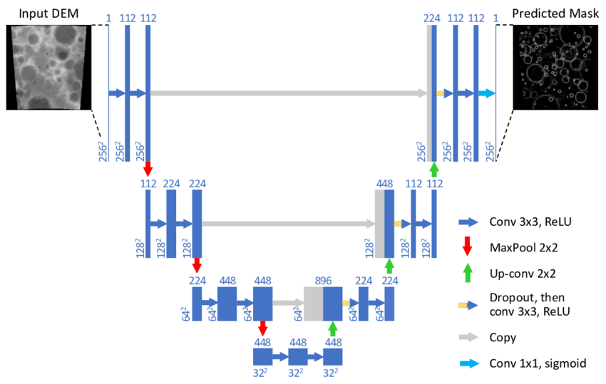

# Data Science Bowl 2018

Data science bowl 2018 is a competition held by [Kaggle](https://www.kaggle.com/c/data-science-bowl-2018) which aims to advance medical treatment using the power of Computer vision especially in the golden era of Deep Convolutional Neural Networks (**D-CNN**)

## Competition Brief

<b><i>Spot Nuclei. Speed Cures</i></b>. Imagine speeding up research for almost every disease, from lung cancer and heart disease to rare disorders. The 2018 Data Science Bowl offers our most ambitious mission yet: create an algorithm to automate nucleus detection.

We’ve all seen people suffer from diseases like cancer, heart disease, chronic obstructive pulmonary disease, Alzheimer’s, and diabetes. Many have seen their loved ones pass away. Think how many lives would be transformed if cures came faster.

By automating nucleus detection, you could help unlock cures faster—from rare disorders to the common cold. Want a snapshot about the 2018 Data Science Bowl? [View this video](https://www.youtube.com/watch?v=eHwkfhmJexs&feature=youtu.be).

### Why nuclei

Identifying the cells’ nuclei is the starting point for most analyses because most of the human body’s 30 trillion cells contain a nucleus full of DNA, the genetic code that programs each cell. Identifying nuclei allows researchers to identify each individual cell in a sample, and by measuring how cells react to various treatments, the researcher can understand the underlying biological processes at work.

---
## Solution Approach
Our training data is a bit challengy, & that's awesome! For each training example we have the full image of cell(s) and for each nucleus in the image we have the nuclei' mask individually seperated in its own file.

### Data Preprocessing
Since our training data is quite low (~600 images) we will try to discard the less-important-highly-varied information found in images. Upon inspection (feel free to download the data and investigate via [this link](https://www.kaggle.com/competitions/data-science-bowl-2018/data)) images come in different colours, different illuminations, so... Let's discard this variations and enhance our image data through converting all the image into grayscale image, and later to Black and White images using some image processing techinques.

### Training Process
We will use the powerful `Convolutional Neural Networks` (**CNNs for short**) to train our image data, keeping in mind that we will use a state-of-the-art network titled [U-Net: Convolutional Networks for Biomedical Image Segmentation](https://arxiv.org/abs/1505.04597).

#### The U-Net Architecture
U-Net (introduced in 2015) is quite powerful segmentation network especially when to it comes to limited training data (as per our case) *For more info check paper link provided*. **Why it's called U-Net?** Well give its architecture a look! (**Note: slightly modified than original paper**).

 
<u><a href="https://www.researchgate.net/figure/Convolutional-neural-network-CNN-architecture-based-on-UNET-Ronneberger-et-al_fig2_323597886">Source: Research Gate</a></u>

